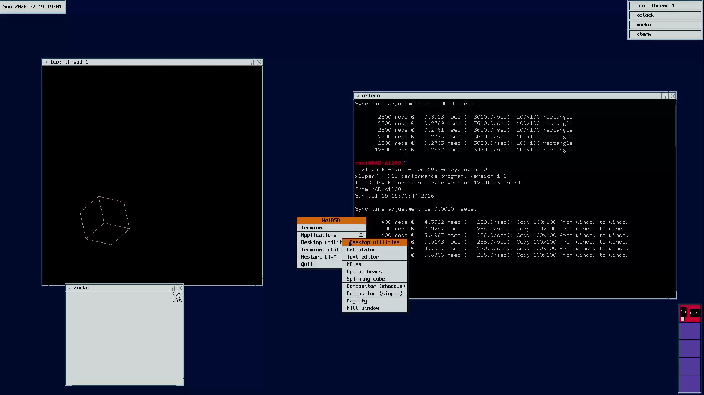
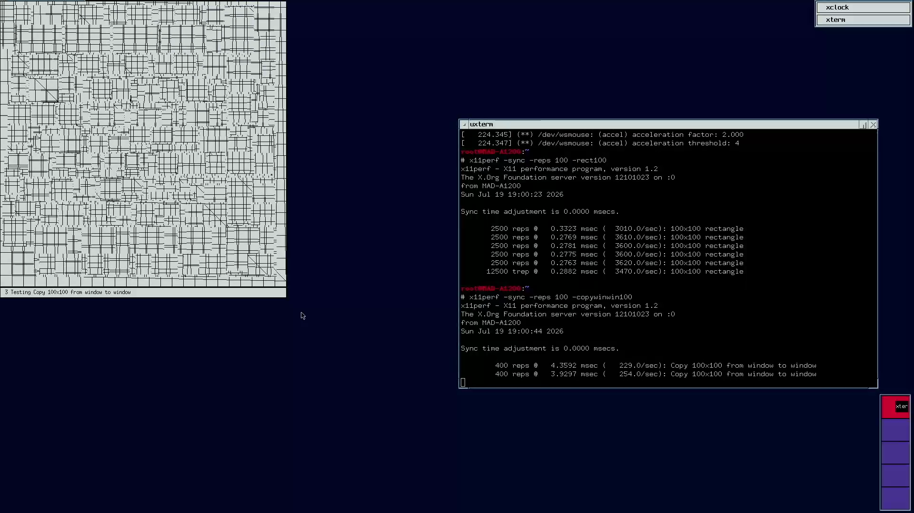
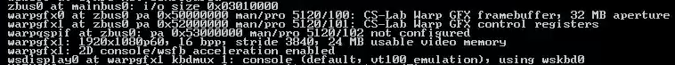
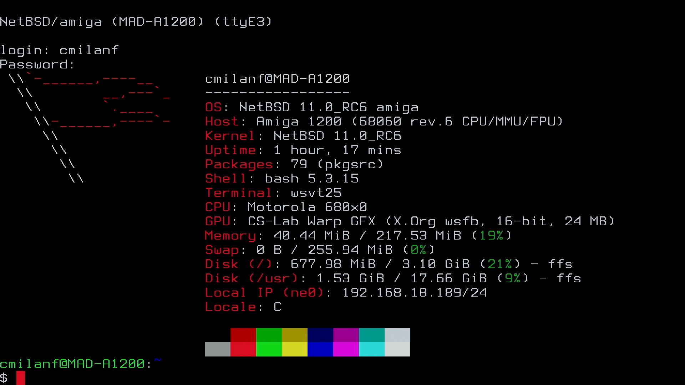
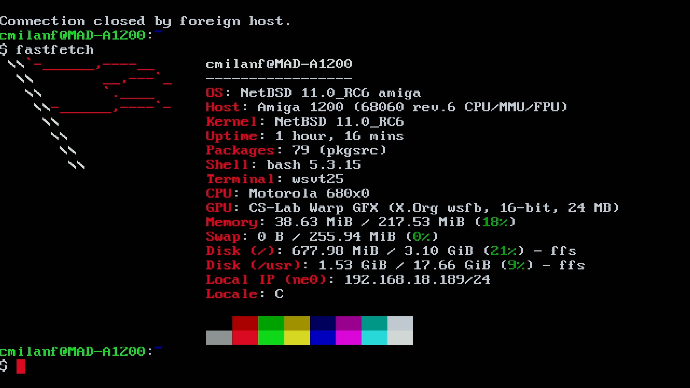
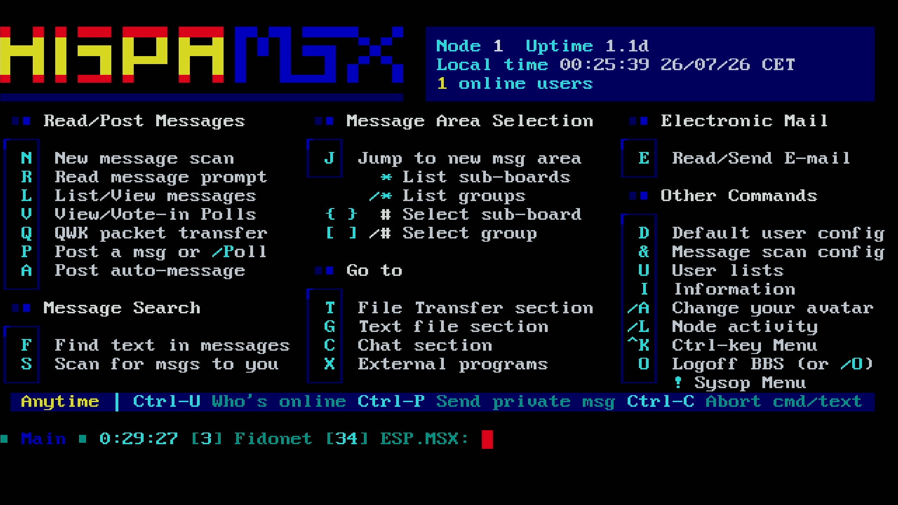

# WarpGFX: NetBSD/amiga kernel driver and accelerated Xorg/wsfb

[NetBSD/amiga](https://wiki.netbsd.org/ports/amiga/) [wsdisplay](https://man.netbsd.org/wsdisplay.4) driver for the [CS-Lab Warp 1260](https://amigawarp.eu/product/warp-1260-board-for-amiga-1200/) RTG hardware, with **hardware-accelerated** console and [Xorg EXA](https://man.netbsd.org/exa.4) support.

> **DISCLAIMER**  
> This software is provided **AS IS**, without warranty of any kind, express or implied. There is no guarantee that it will work as described or that it is fit for any particular purpose. You use it entirely at your own risk. Because this project modifies kernel and Xorg components and drives real hardware, you are responsible for reviewing the source code, verifying its correct behavior in your own environment, and keeping backups and known-good fallbacks before installing or running any of it. The author accepts no liability for any damage, data loss, or other consequences arising from its use.
>
> **The code in this repository was developed with assistance from Kiro and OpenAI GPT-5.6-Sol.**

Prebuilt kernels are available from the [GitHub releases](#releases). Building from source runs on a NetBSD host: NetBSD's cross-build system supports building the `amiga` target from a different host architecture, so an `amd64` NetBSD machine can compile the amiga kernel and Xorg components; an Amiga host is not required for compilation. Installing the resulting kernel and Xorg module happens on the Amiga.

Features:

- six 16-bit `R5G6B5` video modes: 640x480, 800x600, 1024x768, 1280x720, 1280x1024, and 1920x1080;
- hardware rectangle fill/copy acceleration for the wscons console;
- EXA Solid/Copy acceleration for Xorg through the standard wsfb driver;
- red XOR text cursor, multiple virtual screens, and named 80x25 and 80x27 geometries;
- optional reproducible 24x40 ISO and classic VGA raw-CP437 wscons font bundle;
- the unconfigured Warp 1260 QSPI Flash device (product 5120/102) is identified but not accessed.

## Index

- [Screenshots and video](#screenshots-and-video)
- [Performance testing](#performance-testing)
- [Releases](#releases)
- [Install](#install)
  - [Install the kernel](#install-the-kernel)
  - [Install the optional wscons fonts](#install-the-optional-wscons-fonts)
  - [Install the Xorg wsfb module](#install-the-xorg-wsfb-module)
  - [Configure and verify Xorg](#configure-and-verify-xorg)
- [Building](#building)
  - [Target releases](#target-releases)
  - [Creating releases](#creating-releases)
  - [Build a subset](#build-a-subset)
  - [Package and publish releases](#package-and-publish-releases)
- [Advanced Building](#advanced-building)
  - [Repository layout and sources](#repository-layout-and-sources)
  - [Single end-to-end build](#single-end-to-end-build)
  - [Regenerate the canonical patches](#regenerate-the-canonical-patches)
  - [Rebase onto newer NetBSD bases](#rebase-onto-newer-netbsd-bases)
  - [Apply patches to clean trees](#apply-patches-to-clean-trees)
  - [Kernel configuration options](#kernel-configuration-options)
  - [Build the Xorg wsfb module](#build-the-xorg-wsfb-module)

## Screenshots and video

<table>
  <tr>
    <td width="50%" align="center">
      <a href="https://youtu.be/iFda9PB3n1w">
        
      </a>
      <br>
      <sub><strong>X11 spinning-cube demo</strong> — select the image to watch the video on YouTube. <a href="screenshots/netbsd-amiga-warpgfx-x11-spinning-cube.png">View full size</a>.</sub>
    </td>
    <td width="50%" align="center">
      <a href="screenshots/netbsd-amiga-warpgfx-test.png">
        
      </a>
      <br>
      <sub><strong>WarpGFX display test</strong> running on NetBSD/amiga. Select the image to view full size.</sub>
    </td>
  </tr>
  <tr>
    <td colspan="2" align="center">
      <a href="screenshots/netbsd-amiga-warpgfx-dmesg.png">
        
      </a>
      <br>
      <sub><strong>Kernel detection</strong> of the WarpGFX devices. Select the image to view full size.</sub>
    </td>
  </tr>
  <tr>
    <td width="50%" align="center">
      <a href="screenshots/warpgfx-font-terminus.png">
        
      </a>
      <br>
      <sub><strong>WarpConsole font</strong> derived from Terminus Font. Select the image to view full size.</sub>
    </td>
    <td width="50%" align="center">
      <a href="screenshots/warpgfx-font-ibm.png">
        
      </a>
      <br>
      <sub><strong>WarpConsole VGA font</strong> with classic IBM CP437 glyphs. Select the image to view full size.</sub>
    </td>
  </tr>
  <tr>
    <td colspan="2" align="center">
      <a href="screenshots/warpgfx-font-ibm-ansi.png">
        
      </a>
      <br>
      <sub><strong>IBM ANSI artwork</strong> rendered with the WarpConsole VGA CP437 font. Select the image to view full size.</sub>
    </td>
  </tr>
</table>

## Performance testing

[x11perf](https://man.netbsd.org/x11perf.1) has been used to benchmark the driver improvements with the `rect100` and `copywinwin100` tests:

```shell
/usr/X11R7/bin/x11perf -sync -reps 100 -rect100
/usr/X11R7/bin/x11perf -sync -reps 100 -copywinwin100
```

Results are available in the `testing/x11perf` folder. The following table is a summary of the test:

| Test | Video mode | Chipset | EXA | Average result | Improvement |
| ---- | ---------- | ------- | --- | -------------- | ----------- |
| rect100 | 640x480 8 bit | AGA | No | 377.4 ops/sec | 1x (baseline) |
| copywinwin100 | 640x480 8 bit | AGA | No | 119.2 ops/sec | 1x (baseline) |
| rect100 | 1920x1080 16 bit | WarpGFX | No | 1010.0 ops/sec | 2.68x |
| copywinwin100 | 1920x1080 16 bit | WarpGFX | No | 113.0 ops/sec | 0.95x |
| rect100 | 1920x1080 16 bit | WarpGFX | Solid Copy | 4910.0 ops/sec | 13.01x |
| copywinwin100 | 1920x1080 16 bit | WarpGFX | Solid Copy | 275.0 ops/sec | 2.31x |

  - **Test**. The `x11perf` test.
  - **Video mode**. Display resolution and color depth used in the test.
  - **Chipset**. Whatever Amiga Custom Chips (AGA in this case) or Warp RTG was used.
  - **EXA**. If X11 EXA hardware acceleration was used and for which operations.
  - **Average results**. Average operations per second.
  - **Improvement**. Improvement compared to AGA as baseline.

## Releases

Prebuilt kernel/module bundles are published on the [GitHub releases page](https://github.com/cmilanf/netbsd-amiga-warpgfx/releases). There is one release per target NetBSD version:

| Release tag | NetBSD base | Marked |
| ----------- | ----------- | ------ |
| `warpgfx-11.0` | NetBSD 11.0 (netbsd-11 branch, 11.0_STABLE) | Latest (full release) |
| `warpgfx-current` | NetBSD-current (11.99.x) | Prerelease |

Each release contains, for every CPU and 16-bit resolution, both a `.tar.gz` and a `.lha` archive:

```text
netbsd-amiga-<version>-warpgfx-<warpgfx-version>-<cpu>-<resolution>.{tar.gz,lha}
```

- `<version>` is the NetBSD version: `11.0` or `current`.
- `<warpgfx-version>` is the WarpGFX driver version, e.g. `1.0`.
- `<cpu>` is `68030`, `68040`, or `68060`.
- `<resolution>` is the console/X resolution: `1280x720` or `1920x1080`.

Each archive holds a single top-level directory containing the kernel (`netbsd-warpgfx`), the accelerated Xorg driver (`wsfb_drv.so.0`), and `BUILD-INFO.txt`, which records the `src`/`xsrc` commits, CPU, WarpGFX options, and SHA-256 hashes for both binaries. A `SHA256SUMS-<version>.txt` in the release lists the checksum of every archive. Kernels are built reproducibly (`MKREPRO`), so a given archive's contents are deterministic.

The WarpGFX driver version is not printed at boot; query it on the running system with:

```sh
sysctl hw.warpgfx.version
```

Pick a release matching your NetBSD version, or `warpgfx-current` if you track `-current`. Match the archive to your CPU and preferred resolution. Every binary archive ships the matching `netbsd-warpgfx` kernel, the release's accelerated Xorg `wsfb_drv.so.0` module, and `BUILD-INFO.txt`.

If you need the driver to apply for a NetBSD version not covered in releases, proceed to the [build a subset](#build-a-subset) section.

## Install

Installation is performed on the Amiga. Always keep a known-good fallback before replacing a working kernel or module.

### Install the kernel

1. Download the archive matching your CPU and resolution from the [release](#releases), and verify it against the release's `SHA256SUMS-<version>.txt`:

   ```sh
   sha256 -q netbsd-amiga-11.0-warpgfx-1.0-68060-1920x1080.tar.gz
   ```

2. Extract it. Both formats yield the same layout:

   ```sh
   tar xzf netbsd-amiga-11.0-warpgfx-1.0-68060-1920x1080.tar.gz
   # or, on AmigaOS/with lha: lha x netbsd-amiga-11.0-warpgfx-1.0-68060-1920x1080.lha
   ```

   This produces:

   ```text
   netbsd-amiga-11.0-warpgfx-1.0-68060-1920x1080/
   ├── netbsd-warpgfx
   ├── wsfb_drv.so.0
   └── BUILD-INFO.txt
   ```

3. Keep your current working kernel as a fallback, then place the new `netbsd-warpgfx` where your Amiga bootblock or AmigaOS `loadbsd` setup loads it. Test it without removing the known-good kernel.

4. After booting, confirm the driver attached and check its version:

   ```sh
   dmesg | grep -i warp
   sysctl hw.warpgfx.version
   ```

### Install the Xorg wsfb module

The accelerated Xorg support is the standard `wsfb` driver rebuilt with the WarpGFX EXA backend; there is no Warp-specific Xorg module. Use `wsfb_drv.so.0` from the same selected and extracted archive as the kernel so it matches that NetBSD release.

Stop X, change to the extracted archive directory, back up the installed module, and install the archive's module as root:

```sh
cd netbsd-amiga-11.0-warpgfx-1.0-68060-1920x1080
cp /usr/X11R7/lib/modules/drivers/wsfb_drv.so.0 \
   /usr/X11R7/lib/modules/drivers/wsfb_drv.so.0.backup
install -m 0555 ./wsfb_drv.so.0 \
   /usr/X11R7/lib/modules/drivers/wsfb_drv.so.0
```

Retain the previous module as a fallback. If you built from source instead of using a release archive, install the module from that build's output directory in the same way.

### Configure and verify Xorg

Once installed, configure Xorg editing the file `/etc/X11/xorg.conf`:

```text
Section "Device"
    Identifier "WarpGFX"
    Driver "wsfb"
    Option "Device" "/dev/ttyE0"
    Option "ShadowFB" "false"
    Option "Accel" "true"
    Option "HWCursor" "false"
EndSection
```

After starting X, verify the active paths:

```sh
grep -E 'wsdisplay EXA|ShadowFB' /var/log/Xorg.0.log
dmesg | grep -E 'warpqspi|console/wsfb acceleration'
```

The expected Xorg message is:

```text
Using wsdisplay EXA fill/copy acceleration
```

If acceleration causes a regression, `Option "Accel" "false"` selects the already working direct wsfb path without rebuilding.

### Install the optional wscons fonts

The optional [`extras/wscons-fonts`](extras/wscons-fonts/) bundle provides the validated 24x40 WSF needed for exact 1920x1080 coverage (`80×24=1920`, `27×40=1080`) plus a classic VGA raw-CP437 font for an 80x25 ANSI/BBS console. It works using the `80x27` named screen type exported by the WarpGFX kernel driver, fixing terminal geometry at 80 columns by 27 rows.

Install the bundle on the Amiga:

```sh
cd extras/wscons-fonts
./install.sh --dry-run
# Then run as root:
./install.sh
```

The installer places fonts under `/usr/local/share/wscons/fonts` and a complete offline reproducibility bundle under `/usr/local/share/doc/warpgfx-wscons-fonts`.

Manually merge the desired directives from [`wscons.conf.example`](extras/wscons-fonts/wscons.conf.example). The complete example keeps ttyE0 unchanged as the recovery console, configures E1-E3 as exact-fit ISO `80x27` screens, configures E4 as a classic VGA raw-CP437 `80x25` screen.

## Building

The recommended way to produce kernels is using the `scripts/build-releases.sh` script, which builds every target NetBSD release for every CPU and video mode from verified per-release patches, then optionally packages and publishes them exactly like the [releases](#releases) above. The script drives the lower-level [single build](#single-end-to-end-build). `build-releases.sh` must run on a **NetBSD host**; patch generation is portable, and completed artifacts can be packaged on any host with the required archive tools.

The scripts and their generated inputs flow as follows:

```text
src/ and xsrc/ overlays
        +
scripts/canonical-patch-config.sh
        |
        |  create-canonical-patches.sh
        |  (portable; run after changing an overlay)
        v
patches/canonical/*
        +
scripts/create-release-patches.conf
        |
        |  create-release-patches.sh
        |  (portable; rebases and verifies each release)
        v
patches/<label>/*
        |
        |  build-releases.sh                         [NetBSD host]
        |    `-- calls build-netbsd-amiga.sh for each release x CPU x mode
        v
output/<label>/<cpu>-<mode>/
        |  netbsd-warpgfx
        |  wsfb_drv.so.0
        |  BUILD-INFO.txt
        |
        |  create-dist-packages.sh
        v
output/dist/*  -- optional --publish -->  GitHub Releases
```

For a normal build from an unchanged clone, begin with `create-release-patches.sh`: the checked-in canonical patches already exist. Maintainers who change files under `src/` or `xsrc/` must first run `create-canonical-patches.sh` and then regenerate the release patches.

NetBSD sources include a powerful toolchain supporting cross-building. You can use an `amd64` NetBSD install to compile the kernel for `amiga`. Since compiling the kernel and Xorg wsfb driver is a compute intensive task, I recommend using modern hardware and spare the Amiga from the task. Follow these steps from a NetBSD machine:

1. Clone this repository and enter it:

   ```sh
   git clone https://github.com/cmilanf/netbsd-amiga-warpgfx.git
   cd netbsd-amiga-warpgfx
   ```

2. Generate the verified patches for all configured NetBSD releases. This command works on NetBSD, Linux, and macOS:

   ```sh
   ./scripts/create-release-patches.sh
   ```

   The patches are written to `patches/<release>/`.

3. On a **NetBSD host**, check the build plan and build all release, CPU, and video-mode combinations:

   ```sh
   ./scripts/build-releases.sh --dry-run
   ./scripts/build-releases.sh
   ```

4. Get the resulting kernel and Xorg module from:

   ```text
   output/<release>/<cpu>-<mode>/netbsd-warpgfx
   output/<release>/<cpu>-<mode>/wsfb_drv.so.0
   ```

5. Optionally package the binaries into installable `.tar.gz` and `.lha` archives:

   ```sh
   ./scripts/create-dist-packages.sh
   ```

   The archives are written to `output/dist/`. This command does not upload anything unless `--publish` is explicitly added.

### Target releases

The canonical patches target a single upstream base. To ship the driver against several NetBSD releases at once, `scripts/create-release-patches.conf` lists each target as `LABEL|SRC_COMMIT|XSRC_COMMIT`:

```text
netbsd-11.0|<src commit>|<xsrc commit>
netbsd-current|<src commit>|<xsrc commit>
```

`scripts/create-release-patches.sh` three-way rebases the canonical patches onto each release's `src` and `xsrc` commits and writes a verified per-release patch set under `patches/<label>/` (`netbsd-src-warpgfx.patch`, `netbsd-xsrc-warpgfx-wsfb-exa.patch`, a repinned `canonical-patch-config.sh`, `SHA256.txt`, and `RELEASE-INFO.txt`):

```sh
./scripts/create-release-patches.sh            # all active releases
./scripts/create-release-patches.sh --only netbsd-current
```

It is non-destructive: it never rewrites the canonical patches under `patches/canonical/` or overlays, verifies forward and reverse application plus an exact tree match for every release, and reports a rebase conflict for a release rather than emitting an unverified patch. This step needs only Git and a SHA-256 tool, so it also runs on Linux and macOS.

Because the release commits come from the NetBSD GitHub mirrors, which expose branches rather than release tags, the commit for each label pins an exact point on that branch; the version string in `sys/sys/param.h` at each commit is recorded in `create-release-patches.conf` for provenance. A release whose surrounding upstream context has diverged too far to rebase cleanly is left out of the manifest rather than carried as a hand-maintained exception.

### Creating releases

`scripts/build-releases.sh` builds every active release against each CPU and video mode. For each release it runs a full build (with neither `--no-xorg` nor `--only-kernel`) until one combination successfully produces both the kernel and accelerated `wsfb_drv.so.0`. Later combinations reuse the release's module and build kernels with `--only-kernel`; if a full build fails, the next combination attempts another full build. Every successful output directory contains `netbsd-warpgfx`, `wsfb_drv.so.0`, and `BUILD-INFO.txt` with both SHA-256 hashes. `RELEASE-SUMMARY.txt` lists the kernel and driver SHA-256 for each successful combination.

```sh
./scripts/build-releases.sh --dry-run              # print the planned builds
./scripts/build-releases.sh -j 8 \
  --work-dir "$HOME/warpgfx-release-build" \
  --output  "$HOME/warpgfx-release-repo/output"
```

Defaults are every active release x `68030 68040 68060` x `720 1080` (twelve kernel/module combinations for two releases). A failed combination is recorded and the release build continues; the script exits non-zero if any combination failed.

When the patches have changed since a previous run (for example after editing the driver and regenerating them), pass `--reset-sources`. On the first combination of each release it discards cached source edits and reapplies the current patch, preserving the cached cross-tools and objects:

```sh
./scripts/build-releases.sh -j 8 --reset-sources
```

### Build a subset

Restrict any axis to build only what you need:

```sh
./scripts/build-releases.sh --releases netbsd-current --cpus 68060 --modes 1080
```

`--releases`, `--cpus`, and `--modes` each take a space-separated list.

### Package and publish releases

`scripts/create-dist-packages.sh` packages the release kernel/module combinations into per-combination archives and (optionally) publishes them as GitHub releases. It requires nonempty `<input>/<label>/<cpu>-<mode>/netbsd-warpgfx` and `wsfb_drv.so.0` files (default input `output/`) and writes, for every combination, both a `.tar.gz` and a `.lha`:

```text
netbsd-amiga-<version>-warpgfx-<warpgfx-version>-<cpu>-<resolution>.{tar.gz,lha}
```

`<version>` is the release label without its `netbsd-` prefix (`11.0`, `current`), `<warpgfx-version>` is the driver version (from `WARPGFX_VERSION` in the driver header, or `--driver-version`), and `<resolution>` is the pixel geometry mapped from the `WARPGFX_MODE` token (`720`→`1280x720`, `1080`→`1920x1080`, and so on). Each archive holds a single top-level directory with the kernel (named `netbsd-warpgfx` by default; change with `--kernel-name`), `wsfb_drv.so.0` installed with mode `0555`, and `BUILD-INFO.txt` containing both artifact hashes. A `SHA256SUMS-<version>.txt` accompanies each version's archives. Building archives requires `tar`, `gzip`, and an `lha` implementation; publishing additionally requires an authenticated `gh`.

Building archives is always local and safe. Uploading happens only with `--publish`; without it the script builds every archive and prints the exact `gh` commands it would run:

```sh
./scripts/create-dist-packages.sh                     # build archives + dry-run
./scripts/create-dist-packages.sh --publish           # create/update GitHub releases
./scripts/create-dist-packages.sh --releases netbsd-current --formats "tar.gz"
```

Each NetBSD version becomes one GitHub release tagged `warpgfx-<version>` containing that version's archives plus its `SHA256SUMS`. RC and `current` versions are marked prerelease automatically (override with `--stable`/`--prerelease`). The release title and notes show the WarpGFX driver version, taken from `WARPGFX_VERSION` in the driver header (override with `--driver-version`), and remind readers it is queryable with `sysctl hw.warpgfx.version`. Re-running `--publish` updates the release notes and clobbers changed assets, so moving the `current` pin and rebuilding refreshes its release in place.

## Advanced Building

This section covers the lower-level tools used by the release build: the single end-to-end build script, the patch-generation and rebase tooling, the source-of-truth configuration, manual kernel configuration, and building the Xorg module by hand.

`build-netbsd-amiga.sh` and `build-releases.sh` are supported only on NetBSD and reject other hosts. The maintenance scripts `create-canonical-patches.sh`, `update-canonical-patches.sh`, and `create-release-patches.sh` use POSIX `/bin/sh` and are supported on NetBSD, Linux, and macOS. They require Git 2.25 or newer for sparse-checkout and partial-clone support, plus one available SHA-256 command: `sha256`, `shasum`, or `sha256sum`.

### Repository layout and sources

- `src/` and `xsrc/`: the modified files at their complete upstream-relative paths — every modified file, not copies of all untouched files in the very large upstream repositories.
- `patches/canonical/netbsd-src-warpgfx.patch` and `patches/canonical/netbsd-xsrc-warpgfx-wsfb-exa.patch`: complete canonical patches for clean source trees at the pins in `scripts/canonical-patch-config.sh`.
- `scripts/canonical-patch-config.sh`: the single machine-readable source of truth for upstream URLs, pinned base commits, and the managed path lists. Always update pins and paths here, never hard-code them elsewhere. Its managed path lists are whitespace-delimited, so managed paths must not contain whitespace or shell wildcard characters. It is sourced configuration, not a standalone command.
- `patches/canonical/SHA256.txt`: SHA-256 checksums for the two canonical patch files (regenerated by the scripts).
- `scripts/create-release-patches.conf` and `patches/<label>/`: the multi-release manifest and generated per-release patch sets (see [Target releases](#target-releases)).
- `extras/wscons-fonts/`: optional reproducible ISO 80x27 and VGA raw-CP437 80x25 console fonts, a non-destructive installer, example configuration, validation, and separately scoped font licenses.
- `ATTRIBUTIONS.md`: authorship, provenance, and licensing record.

The clean base commits are the unmodified upstream revisions against which the patches are generated. Their immutable commit IDs are in `scripts/canonical-patch-config.sh`. To clone the official mirrors and check out those exact bases:

```sh
. ./scripts/canonical-patch-config.sh
git clone "$SRC_URL" "$HOME/netbsd-amiga-warpgfx-build/src"
git -C "$HOME/netbsd-amiga-warpgfx-build/src" checkout "$SRC_BASE"
git clone "$XSRC_URL" "$HOME/netbsd-amiga-warpgfx-build/xsrc"
git -C "$HOME/netbsd-amiga-warpgfx-build/xsrc" checkout "$XSRC_BASE"
```

Do not apply a complete patch to a tree that already contains an earlier WarpGFX patch.

### Single end-to-end build

`scripts/build-netbsd-amiga.sh` is the individual builder that the release builder drives. On a NetBSD host it checks the build environment and Git package, verifies the patches against their checksums, fetches the pinned `src` and `xsrc` commits, builds amiga tools, the kernel, and Xorg, and copies the kernel and accelerated `wsfb` module into `output/`:

```sh
./scripts/build-netbsd-amiga.sh
```

Select a CPU-specific kernel configuration and WarpGFX options when needed:

```sh
./scripts/build-netbsd-amiga.sh --cpu 68060 \
  --warpgfx console,accel,mode=1080,no-debug --jobs 2
```

`--cpu` accepts `68030`, `68040`, or `68060`. It generates a small kernel configuration that includes `WSCONS` and disables the other CPU options (and their FPU/SP options — see [Kernel configuration options](#kernel-configuration-options)); NetBSD then selects the appropriate compiler flags automatically. Omitting `--cpu` preserves NetBSD's default amiga CPU support. WarpGFX option tokens default to `console,accel,mode=720,no-debug`; supported `mode=` values are `480`, `600`, `720`, `768`, `1024`, and `1080`. Run the script with `--help` for the full list of tokens, workspace, and output controls.

Kernel builds are reproducible by default: the script passes `MKREPRO=yes`, preventing the kernel version string from embedding the build username, hostname, timestamp, and object directory. Pass `--non-reproducible` to restore NetBSD's traditional version string with those host details. The generated version object is refreshed on every run so switching modes cannot reuse stale metadata from the persistent build cache.

Use `--only-kernel` when an Xorg rebuild is unnecessary:

```sh
./scripts/build-netbsd-amiga.sh --only-kernel --cpu 68060 \
  --warpgfx console,accel,mode=1080,no-debug
```

Kernel-only mode requires an existing `tools-amiga` cache from a previous full build. It reuses those cross-tools without running the tools target, executes only the kernel build target, and writes the kernel plus `BUILD-INFO.txt` to `output/`. It does not build the Xorg distribution or `wsfb` driver. An existing `output/wsfb_drv.so.0` is left unchanged and is not listed in the new build metadata. `--no-xorg` builds the cross-tools and kernel but skips the Xorg distribution, which is useful when bootstrapping a fresh workspace without needing an Xorg module. On a fresh workspace, run one full build, or a `--no-xorg` build, before using `--only-kernel`.

The default workspace, `~/netbsd-amiga-warpgfx-build`, is persistent. The first run downloads the pinned `src` and `xsrc` commits and builds all artifacts; later runs validate those commits and the exact WarpGFX patch state, then use NetBSD's update mode to rebuild only what changed. Existing workspaces created by earlier versions of this script are accepted when their source trees match the pinned commits and patches. If the repository patches changed, `--reset-sources` validates the cached checkouts, runs `git reset --hard` and `git clean -fd` only inside the workspace's `src` and `xsrc` trees, and reapplies the current patches while preserving `obj-amiga` and `tools-amiga`. This intentionally discards any edits in those cached source trees. A workspace lock prevents concurrent builds from sharing objects. If the configured revisions changed, the source trees contain edits that must be preserved, or a stale lock remains after an interrupted host, use a new `--work-dir`; remove `.build-lock` manually only after confirming no build is running.

NetBSD-generated object and tool files embed absolute source, object, and tool paths. Do not rename a populated build workspace if its caches must remain reusable; `--reset-sources` does not rewrite those cached paths. If a workspace has already moved, retain the original path as a symlink to the new physical directory and continue passing the original path to `--work-dir` for the lifetime of that cache. Otherwise remove `obj-amiga` and `tools-amiga` and rebuild them at the new path.

The build script also accepts release-override flags used by the release builder: `--config FILE` selects a `canonical-patch-config.sh` (pinned bases) to source, `--src-patch FILE`/`--xsrc-patch FILE` select the patches to apply, and `--checksums FILE` selects the `SHA256.txt` to verify them against. Defaults reproduce the standard behavior against the canonical patches under `patches/canonical/`. The script builds without installing anything and prints kernel, Xorg module, rollback, configuration, and verification guidance when it completes.

### Regenerate the canonical patches

Edit managed files directly under `src/` and `xsrc/`, preserving their paths, then run:

```sh
./scripts/create-canonical-patches.sh
```

The script sparsely fetches the pinned clean commits, overlays the vendored files, checks whitespace, verifies normal and reverse patch application, and updates both canonical patches and `patches/canonical/SHA256.txt`. After changing the driver, regenerate the per-release patch sets too (see [Target releases](#target-releases)).

### Rebase onto newer NetBSD bases

First commit or revert changes to the managed overlays, patches, configuration, and checksum file. Preview a rebase onto the current HEAD of each official mirror without changing this repository:

```sh
./scripts/update-canonical-patches.sh --latest --dry-run
```

If it succeeds, perform the update:

```sh
./scripts/update-canonical-patches.sh --latest
```

For a reproducible selected pair instead of moving HEADs:

```sh
./scripts/update-canonical-patches.sh --src SRC_COMMIT --xsrc XSRC_COMMIT
```

The updater verifies that the existing patches reproduce all vendored files, resolves targets to full commit IDs, requires fast-forward history by default, and cherry-picks each patch as a synthetic commit onto its new base. It rejects changes outside the managed path lists, unsupported deletions or file-type changes, whitespace errors, and any result that fails forward/reverse application or exact tree comparison. Both repositories must pass before a rollback-protected transaction replaces overlays, patches, pins, and checksums.

On a merge conflict the script changes no repository files and retains its temporary Git trees for inspection. `--keep-temp` also retains successful work; `--allow-non-fast-forward` permits a history rewrite only when explicitly requested. A clean textual rebase does not prove source or ABI compatibility: build the amiga kernel and Xorg wsfb module before publishing. Also note that `src` and `xsrc` mirror HEADs are resolved independently and may not represent an atomically published pair; explicit reviewed commits are preferable for a release.

### Apply patches to clean trees

```sh
cd "$HOME/netbsd-amiga-warpgfx-build/src"
git apply --check /path/to/netbsd-amiga-warpgfx/patches/canonical/netbsd-src-warpgfx.patch
git apply /path/to/netbsd-amiga-warpgfx/patches/canonical/netbsd-src-warpgfx.patch

cd "$HOME/netbsd-amiga-warpgfx-build/xsrc"
git apply --check /path/to/netbsd-amiga-warpgfx/patches/canonical/netbsd-xsrc-warpgfx-wsfb-exa.patch
git apply /path/to/netbsd-amiga-warpgfx/patches/canonical/netbsd-xsrc-warpgfx-wsfb-exa.patch
```

For non-Git source trees, use `patch -p1 < patch-file` instead. Use the canonical patches for a tree at the pinned base, or a release's patch set under `patches/<label>/` for that release's `src`/`xsrc` commits.

### Kernel configuration options

The base kernel configuration is `$HOME/netbsd-amiga-warpgfx-build/src/sys/arch/amiga/conf/WSCONS`, which includes `GENERIC`. To build a CPU-specific kernel, create a derived configuration alongside it; selecting a single CPU makes the NetBSD build system supply the correct compiler flags. For example, a M68060-only configuration `WSCONS060`:

```text
include "arch/amiga/conf/WSCONS"

# Generate code exclusively for the Motorola 68060.
no options M68020
no options M68030
no options M68040

# 68040-only and generic FPU support are unnecessary.
no options FPSP
no options FPU_EMULATE
```

Follow the same procedure for M68030 or M68040. Notice that M68020 lacks an MMU, so it would require a M68851 to work with NetBSD, a configuration that no Amiga computer featured.

When you disable `M68060`, also disable the 68060 software support package with `no options M060SP`. `M060SP` (enabled in `GENERIC`, "required for 060") compiles `netbsd060sp.S`, which references the `buserr60` handler that only exists when `M68060` is defined; leaving `M060SP` on in a 68030- or 68040-only kernel fails at link with `undefined reference to buserr60`. `scripts/build-netbsd-amiga.sh` already emits `no options M060SP` for its `--cpu 68030` and `--cpu 68040` configurations and keeps it for `--cpu 68060`.

The FPU support options are also CPU-specific, and the build script sets them accordingly. `FPSP` (the 68040 floating-point support package) emulates the transcendental instructions the 68040 FPU traps rather than implementing in hardware; it is kept only for `--cpu 68040` and disabled for 68030 and 68060. `FPU_EMULATE` (full software FPU) is kept only for `--cpu 68030`, whose CPU has no on-chip FPU and may run without a 68881/68882; it is disabled for 68040 and 68060, which have integrated FPUs. The 68060 uses neither and relies on `M060SP` for its unimplemented instructions.

The relevant WarpGFX options in `WSCONS` are:

```text
warpgfx* at zbus?
options  WARPGFX_CONSOLE
options  WARPGFX_ACCEL
options  WARPGFX_MODE=1080
#options WARPGFX_DEBUG
```

Supported 16-bit mode values are `480`, `600`, `720`, `768`, `1024`, and `1080`. Omitting `WARPGFX_DEBUG` suppresses register dumps; normal device and acceleration status lines remain. The driver software version (`WARPGFX_VERSION` in `sys/arch/amiga/dev/warpgfxreg.h`) is not printed at boot; it is exposed as the read-only sysctl `hw.warpgfx.version`.

Build a derived configuration directly with `build.sh`:

```sh
cd "$HOME/netbsd-amiga-warpgfx-build/src"
./build.sh -m amiga \
  -O "$HOME/netbsd-amiga-warpgfx-build/obj-amiga" \
  -T "$HOME/netbsd-amiga-warpgfx-build/tools-amiga" \
  -V MKREPRO=yes \
  -j2 kernel=WSCONS060
```

`MKREPRO=yes` omits host-specific provenance from the kernel version string. Leave out `-V MKREPRO=yes` only when the traditional build username, hostname, timestamp, and object path are intentionally wanted. Keep the currently working kernel available as a fallback before installing the new one.

### Build the Xorg wsfb module

Full build:

```sh
cd "$HOME/netbsd-amiga-warpgfx-build/src"
./build.sh -m amiga \
  -O "$HOME/netbsd-amiga-warpgfx-build/obj-amiga" \
  -T "$HOME/netbsd-amiga-warpgfx-build/tools-amiga" \
  -D "$HOME/netbsd-amiga-warpgfx-build/obj-amiga/destdir.amiga" \
  -X "$HOME/netbsd-amiga-warpgfx-build/xsrc" \
  -x -u -j2 distribution
```

Targeted rebuild, when the destination tree already has the required Xorg headers and libraries:

```sh
cd "$HOME/netbsd-amiga-warpgfx-build/src/external/mit/xorg/server/drivers/xf86-video-wsfb"
env DESTDIR="$HOME/netbsd-amiga-warpgfx-build/obj-amiga/destdir.amiga" \
    X11SRCDIR="$HOME/netbsd-amiga-warpgfx-build/xsrc" \
    MKX11=yes \
    "$HOME/netbsd-amiga-warpgfx-build/tools-amiga/bin/nbmake-amiga" cleandir dependall install
```

The resulting module is normally:

```text
$HOME/netbsd-amiga-warpgfx-build/obj-amiga/destdir.amiga/usr/X11R7/lib/modules/drivers/wsfb_drv.so.0
```

Install and configure it as described in [Install the Xorg wsfb module](#install-the-xorg-wsfb-module) and [Configure and verify Xorg](#configure-and-verify-xorg). Stop X before replacing the installed module and retain the previous module as a fallback.
